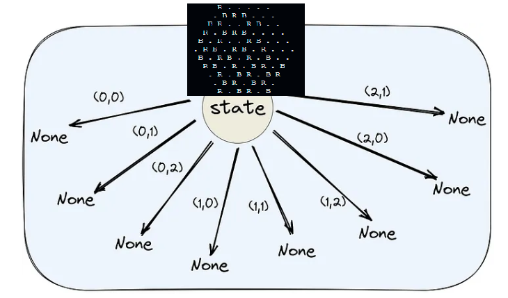
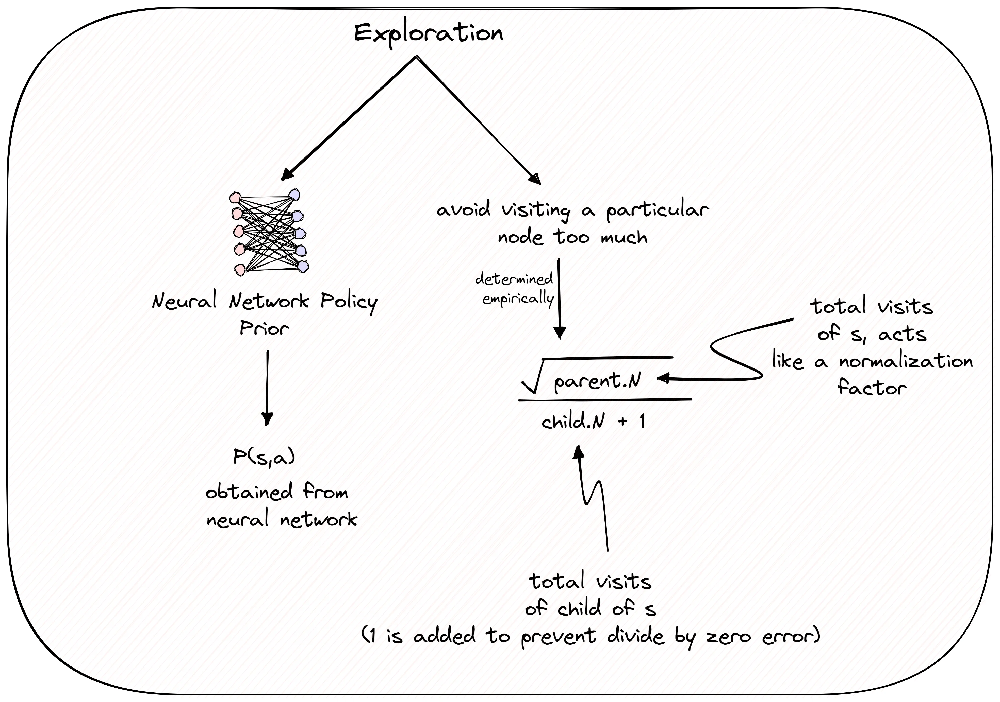

# Le projet Gopher and Dodo ou le plus gros flop de l'Histoire

## Introduction

Pour commencer ce titre un peu aguicheur, je vais vous raconter un projet d'IA02 qui m'a pris plus d'une nuit sans dormir pendant plusieurs semaines et qui fut un échec total.

Le projet Gopher and Dodo est un projet pour l'UV d'IA02 dans lequel il fallait mettre en place une IA pour jouer aux jeux Dodo et Gopher que vous trouverez dans le dossier Règles. Ce sont des jeux extrêmement simples et très faciles à mettre en place. (Ce qui est en partie la cause de mon échec).

## Modélisation des jeux

Je vais passer le fait d'expliquer les règles du jeu mais je vais m'attarder sur deux modélisations des jeux. Dans chaque dossier de jeu, vous avez game et game_2. La première modélisation est la plus complexe car elle devait s'adapter pour pouvoir implémenter AlphaZero. Elle prend en compte un système de tableau pour gérer les états et un système qui permet d'encoder cet état pour pouvoir le passer dans un réseau de neurones. Les parties qui diffèrent d'une modélisation de base sont : get_encoded_state et next_state_encoded. La fonction get_encoded_state permet, en ayant un état de jeu donné, d'obtenir trois matrices de jeu avec : les coups adverses, les coups jouables et enfin les coups joués par le joueur. La fonction next_state_encoded permet de passer d'un état de jeu à un autre en donnant un coup à partir d'une matrice 1D de l'ensemble des coups jouables. Par la suite, cette modélisation nous simplifiera l'utilisation d'un modèle ResNet pour AlphaZero.

La deuxième modélisation est beaucoup plus classique avec l'utilisation de dictionnaires pour gérer les états et les coups. Cela permet de simplifier l'implémentation de l'IA comme MinMax et simplifie grandement les calculs et la gestion des états.

## Première exploration

Après avoir modélisé les jeux assez rapidement et fait une première version de l'IA, j'ai constaté que rapidement j'arrivais à faire une IA de MinMax. L'IA n'était pas très performante mais elle arrivait à jouer correctement, ce qui me satisfaisait.

Ainsi, pour aller plus loin, j'ai décidé de m'atteler à une des dernières découvertes pour les jeux par Google, l'implémentation de AlphaZero. J'ai donc commencé à lire les articles de Google et à essayer de comprendre comment cela fonctionnait.

## AlphaZero

Pour commencer, laissez-moi vous expliquer comment AlphaZero fusionne l'intuition et la raison pour créer une intelligence artificielle exceptionnelle. Il y a deux modes de pensée dans le raisonnement humain : un mode rapide basé sur l'intuition et un mode lent guidé par des règles explicites.

Dans AlphaZero, le mode rapide est représenté par un réseau de neurones qui prend un état de jeu et produit une politique (une distribution de probabilité sur les actions) et une valeur (un score indiquant la qualité de cet état pour le joueur actuel). Le mode lent, quant à lui, est incarné par une recherche d'arbre de Monte Carlo (MCTS). Imaginez que nous réfléchissons à la prochaine action à prendre dans un jeu d'information parfaite comme le jeu de Réaction en chaîne.

Nous pourrions avoir une intuition sur les meilleures actions à prendre. Cette intuition initiale peut être exprimée sous forme de distribution de probabilité sur les actions, attribuant une probabilité plus élevée aux bonnes actions et plus faible aux mauvaises. Cette distribution est notre "politique" pour cet état donné. Pour améliorer cette politique initiale, nous pouvons envisager les mouvements futurs possibles, en utilisant notre intuition pour évaluer les états intermédiaires et éviter de passer trop de temps sur des nœuds à faible valeur. Après cette recherche d'arbre, nous aurons une meilleure idée des actions à entreprendre, obtenant ainsi une politique améliorée. Ce processus est appelé "amplification" et il est réalisé par MCTS dans AlphaZero. Ensuite, nous utilisons cette politique améliorée pour optimiser notre réseau de neurones, en minimisant la perte d'entropie croisée entre la politique améliorée et la politique initiale, ainsi qu'une autre perte entre les prédictions de valeur du réseau de neurones et la valeur réelle obtenue à la fin d'une partie. En combinant ces deux processus, AlphaZero parvient à développer des agents experts capables de jouer à des jeux de manière très efficace.

## MCTS

Pour comprendre en détail toutes les étapes de la recherche d'arbre de Monte Carlo (MCTS), nous devons commencer par une vue d'ensemble. Dans MCTS appliqué aux jeux, nous effectuons des simulations répétées du jeu à partir d'un état de plateau donné. Dans la MCTS traditionnelle, ces simulations sont menées jusqu'à la fin du jeu. Cependant, l'implémentation de MCTS dans AlphaZero est différente de la méthode traditionnelle car AlphaZero utilise également un réseau de neurones entraîné pour fournir des politiques et des valeurs pour un état de plateau donné.

Les entrées de l'algorithme de recherche dans AlphaZero sont un état de plateau (noté σ) et le nombre d'itérations (également appelé le nombre de simulations) pour lesquelles nous souhaitons exécuter MCTS. Dans notre cas, la sortie de cet algorithme de recherche serait la politique à partir de laquelle nous sélectionnerions une action à jouer pour l'état σ.

L'arbre est construit de manière itérative. Chaque nœud de l'arbre contient un état de plateau et des informations sur les actions valides possibles dans cet état. En utilisant cette structure, AlphaZero peut améliorer continuellement ses décisions en combinant la recherche approfondie de MCTS avec les prédictions fournies par le réseau de neurones, ce qui conduit à une politique de jeu optimisée pour chaque situation rencontrée.

*

### Sélection

La première étape de MCTS est la sélection. On choisit les meilleures arêtes à partir du nœud racine jusqu'à atteindre un nœud terminal ou un nœud non exploré. Les "meilleures arêtes" sont déterminées par un équilibre entre exploration et exploitation, guidé par le réseau de neurones. L'exploration consiste à découvrir de nouvelles informations en visitant de nouveaux nœuds, tandis que l'exploitation utilise les informations existantes pour choisir les nœuds prometteurs.

En pratique, cette phase de sélection suit les arêtes avec les scores les plus élevés, équilibrant les gains attendus et le potentiel de découverte. Cela garantit que l'algorithme explore suffisamment tout en exploitant les actions bénéfiques, maximisant ainsi les chances de trouver une stratégie gagnante.

## Comprendre la règle PUCT

AlphaZero utilise une règle appelée PUCT (Predictor Upper Confidence bounds applied to Trees) pour trouver un équilibre. Cette règle a été conçue de manière empirique, inspirée par les travaux de Rosin dans un cadre de bandits avec prédicteurs. Un article récent de DeepMind discute de quelques alternatives à la PUCT.

La règle PUCT a été développée pour gérer les compromis entre exploration et exploitation dans les arbres de recherche. Elle utilise des prédictions pour guider la recherche, permettant à AlphaZero de naviguer efficacement dans l'espace de jeu.

Si vous voulez plus d'informations sur la règle PUCT, je vous invite à lire l'article suivant : [PUCT](https://medium.com/@bentou.pub/alphazero-from-scratch-in-pytorch-for-the-game-of-chain-reaction-part-2-b2e7edda14fb)

Mais voici une petite image de la formule expliquant la règle PUCT et l'exploration

*

*

Pour bien comprendre comment fonctionne la règle PUCT d'AlphaZero, prenons un exemple concret. Disons que notre réseau neuronal, après avoir été entraîné, nous dit avec une probabilité de 0,3 qu'il faut jouer une action particulière, appelons-la "a". On intègre cette probabilité de 0,3 dans la partie exploration de notre règle PUCT.

Imaginons maintenant que l'état "s" appartient au nœud parent et que l'état obtenu en prenant l'action "a" sur "s" appartient au nœud enfant. Si on visite un nœud particulier trop souvent dans notre recherche MCTS, pour éviter cela et encourager l'exploration d'autres nœuds, on inclut le nombre de visites du nœud enfant dans le dénominateur, et on le normalise en utilisant le nombre total de visites du nœud parent.

Pourquoi prend-on la racine carrée du nombre de visites du nœud parent ? Cette règle PUCT a été conçue de manière empirique, et c'est ce qui a donné les meilleurs résultats parmi toutes les options testées par les chercheurs. En gros, on peut voir ça comme une manière de normaliser le terme child.N + 1 dans le dénominateur.

Il y a un hyperparamètre appelé c_puct que l'on voit dans la figure ci-dessus. Cette constante équilibre les termes d'exploitation et d'exploration. Une valeur typique pour cet hyperparamètre est de 2.

Maintenant qu'on a une idée de comment obtenir PUCT(s, a), revenons à l'étape de sélection dans MCTS.

L'étape de sélection est comme montré dans le bloc ci-dessous : en partant de la racine, on cherche de manière répétée le nœud enfant ayant la valeur PUCT maximale jusqu'à ce qu'on atteigne un nœud dont l'état est encore None (pas encore exploré/initialisé).

### Expansion et évaluation

Une fois la sélection faite, la prochaine étape est d'étendre et d'évaluer ce nœud (dont l'état est encore None). L'extension signifie qu'on initialise l'état du nœud sélectionné selon les règles du jeu. Si le nœud est terminal, on laisse l'état à None et on marque le nœud comme terminal avec l'information du gagnant.

Toutes les nouvelles arêtes du nœud sélectionné sont aussi initialisées. Par exemple, après l'extension, l'arbre ressemblera à la figure ci-dessous.

Ensuite, on évalue le nœud étendu. Par évaluation, on cherche la récompense attendue pour le joueur à ce nœud. Le MCTS traditionnel effectue des simulations depuis le nœud étendu pour trouver la valeur à la fin du jeu, souvent de manière aléatoire.

Le MCTS d'AlphaZero est différent. Ici, on utilise la valeur de sortie du réseau neuronal pour déterminer la valeur du nœud étendu.

C'est un peu comme évaluer une position aux échecs : on calcule quelques coups dans notre tête et on utilise notre intuition pour estimer la qualité de la position résultante, sans faire de simulations jusqu'à la fin du jeu avec des actions aléatoires.

### Backup

Après avoir évalué le nœud étendu, il faut mettre à jour les valeurs Q (réalisées par les valeurs de récompense totales et les comptes de visites totales) pour tous les nœuds, depuis la racine jusqu'au nœud étendu. C'est ce qu'on appelle l'étape de backup dans le MCTS.

## Réseau de neurones

### Schéma global du réseau

```plaintext
Input
  |
Start Block: Conv2d -> BatchNorm2d -> ReLU
  |
Backbone: [ResBlock] x num_resBlocks
  |
+-------------------+
|                   |
Policy Head         Value Head
|                   |
Conv2d -> BatchNorm -> Conv2d -> BatchNorm
ReLU                ReLU
Flatten             Flatten
Linear              Linear


### Schéma global du réseau

```plaintext
Input
  |
Start Block: Conv2d -> BatchNorm2d -> ReLU
  |
Backbone: [ResBlock] x num_resBlocks
  |
+-------------------+
|                   |
Policy Head         Value Head
|                   |
Conv2d -> BatchNorm -> Conv2d -> BatchNorm
ReLU                ReLU
Flatten             Flatten
Linear              Linear
```


### Diagramme du réseau

```plaintext
Input
  |
  V
-------------------------
| Start Block           |
| Conv2d (3 -> num_hidden) |
| BatchNorm2d           |
| ReLU                  |
-------------------------
  |
  V
-------------------------
| Backbone (num_resBlocks)|
| [ResBlock] x num_resBlocks|
-------------------------
  |
  V
-------------------------------------
| Policy Head                      | Value Head
| Conv2d (num_hidden -> 32)        | Conv2d (num_hidden -> 3)
| BatchNorm2d                      | BatchNorm2d
| ReLU                             | ReLU
| Flatten                          | Flatten
| Linear -> game.action_size       | Linear -> 1
|                                  | Tanh
-------------------------------------
```


## Améliorations faites

La première amélioration que j'ai pu faire pour l'entraînement est de paralléliser l'entraînement. En effet, l'entraînement d'AlphaZero est très long et peut prendre plusieurs jours. Ainsi, j'ai décidé de paralléliser l'entraînement en utilisant plusieurs processus pour entraîner le réseau de neurones. On retrouve ça dans AlphaZeroParallele et MCTSParallele. Cela permet de gagner un temps considérable. Il a fallu également traiter des listes de listes d'états encodés, ce qui ne fut pas une mince affaire au début.

## Résultats

Sur mon ordinateur, je n'ai pu entraîner mon modèle uniquement sur 40 parties, ce qui est clairement insuffisant pour avoir un modèle performant. Dans le fichier visualisation, vous pourrez voir les résultats de l'entraînement des modèles si vous décidez d'essayer de les entraîner.

Je pense qu'il faut compter environ 3000 parties pour avoir un modèle performant. Donc il faut clairement améliorer le code pour l'optimiser, en particulier pour la modélisation du jeu.


## Amélioration possible
Je n'ai utilisé qu'au début un tableau pour voir les pions placés. Mais prendre un état muni d'une grille et d'un dictionnaire n'est clairement pas une mauvaise idée, et donc il faudrait revoir la modélisation du jeu pour l'optimiser.

Une autre idée que je n'ai pas eu le temps de faire est de considérer uniquement un état de jeu et par une rotation de 60 degrés, on retrouve facilement les autres états de jeu. Cela permettrait de réduire le nombre d'états de jeu et donc de réduire le temps d'entraînement. Une des améliorations les plus importantes que je n'ai malheureusement pas eu le temps de faire. (c'est, j'imagine, ce sur quoi vous nous attendiez évidemment...)

Enfin, comme vous avez à disposition des IA de jeux plutôt très performantes, une bonne idée serait de commencer l'entraînement du modèle avec ces IA pour qu'elle atteigne plus rapidement un niveau de jeu correct. Je pense que l'entraînement de l'IA sera extrêmement plus rapide au début.


## Conclusion

Ce projet, clairement, j'ai adoré le faire, j'ai appris énormément de choses. Mon seul regret est de ne pas avoir pu le finir correctement. Il y a énormément de choses que j'aurais voulu faire et c'était sûrement trop ambitieux pour notre groupe. Je ne me suis peut-être pas assez rapproché des professeurs pour m'aider au bon déroulement de ce projet. Mais je suis très content de ce que j'ai pu faire et j'espère que vous avez apprécié ce projet autant que moi.

Le projet était très intéressant. La liberté du sujet m'a permis d'explorer et de découvrir divers algorithmes, même si je n'ai pas réussi à les faire tous marcher. Ces difficultés ont pû être surmontées grâce aux capacités de mon binôme. Me concentrer sur des tâches et algorithmes plus simples m'a permis de progresser et de faire progresser le projet. Cette expérience était enrichissante et formatrice.

## utilisations

### Attention Important 
Avant d'installer les requirements, il faut installer PyTorch et CUDA en fonction de votre machine. Pour cela, je vous invite à vous rendre sur le site de PyTorch et de suivre les instructions pour installer PyTorch en fonction de votre machine.  voir [Pytorch](https://pytorch.org/get-started/locally/)

### Création de l'environnement virtuel
```bash
python -m venv env
```

### Activation de l'environnement virtuel
#### Pour Windows
```bash
source env/Scripts/activate
```
#### Pour Linux Mac
```bash
source env/bin/activate
```

### Installation des requierements
```bash
pip install -r requirements.txt
```

### Lancer l'entrainnement
```bash
python train_mcts.py
```

- "num_searches": nombre de recherche pour MCTS
- "C": constante pour la règle PUCT
- "num_iterations": nombre d'itération pour l'entrainnement
- "num_selfPlay_iterations": nombre de partie pour l'entrainnement
- "num_parallel_games": nombre de partie en parallèle
- "num_epochs": nombre d'epoch pour l'entrainnement
- "batch_size": taille du batch : c'est le nombre de partie que l'on va jouer avant de faire un backpropagation
- "temperature": temperature pour la distribution de probabilité
- "dirichlet_epsilon": epsilon pour la distribution de dirichlet
- "dirichlet_alpha": alpha pour la distribution de dirichlet

Si vous voulez charger un modèle pour continuer l'entraînement, vous pouvez décommenter les lignes 17 et 18 et ajouter le chemin du modèle à charger et de l'optimisateur.

Enfin, num_resBlocks et num_hidden sont les hyperparamètres du réseau de neurones. Ils servent à définir le nombre de blocs résiduels et le nombre de neurones dans le réseau de neurones. Comme les jeux sont plutôt simples, il n'est pas nécessaire d'avoir un réseau de neurones très complexe.

### Lancer la visualisation
```bash
python visualisation.py
```

### Lancer un jeu
```bash
python main.py
```